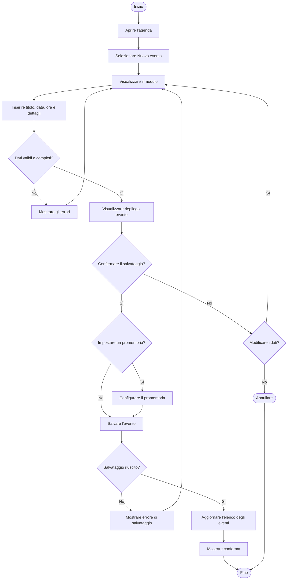
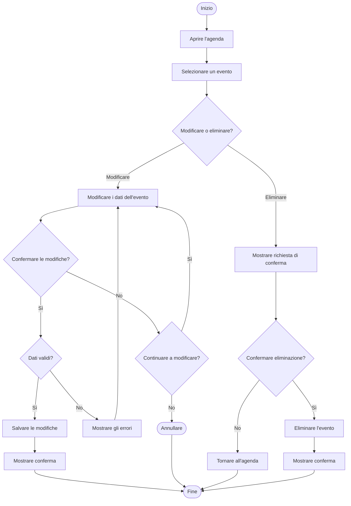
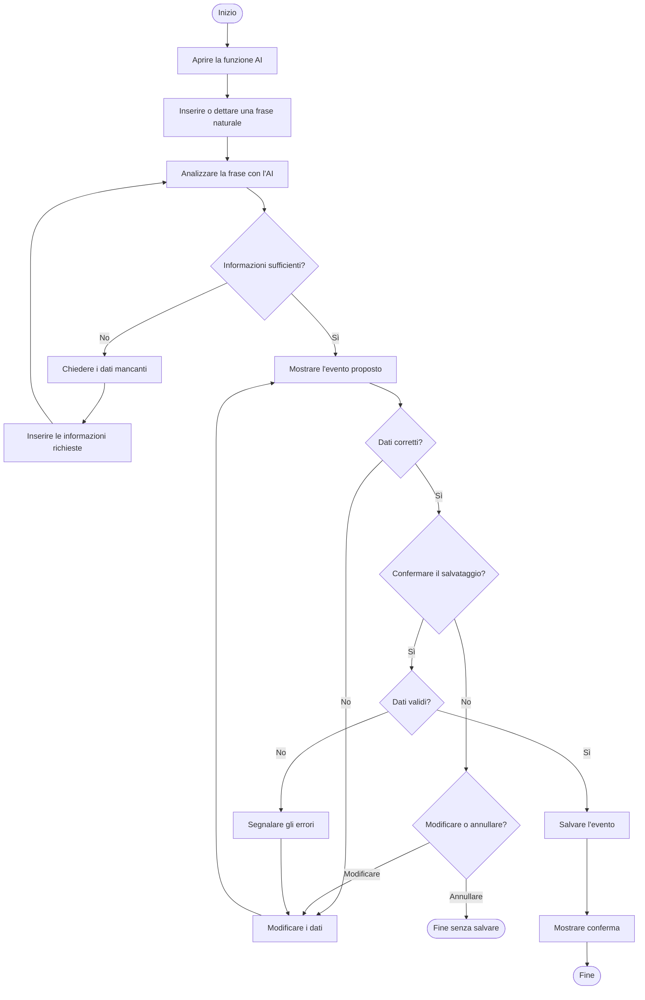

# Creazione evento

```mermaid
flowchart TD
    A([Inizio]) --> B[Aprire l'agenda]
    B --> C[Selezionare Nuovo evento]
    C --> D[Visualizzare il modulo]
    D --> E[Inserire titolo, data, ora e dettagli]
    E --> F{Dati validi e completi?}
    F -- No --> G[Mostrare gli errori]
    G --> D
    F -- Sì --> H[Visualizzare riepilogo evento]
    H --> I{Confermare il salvataggio?}
    I -- No --> J{Modificare i dati?}
    J -- Sì --> D
    J -- No --> K([Annullare])
    I -- Sì --> L{Impostare un promemoria?}
    L -- Sì --> M[Configurare il promemoria]
    L -- No --> N[Salvare l'evento]
    M --> N
    N --> O{Salvataggio riuscito?}
    O -- No --> P[Mostrare errore di salvataggio]
    P --> D
    O -- Sì --> Q[Aggiornare l'elenco degli eventi]
    Q --> R[Mostrare conferma]
    R --> S([Fine])
    K --> S

```

# Modifica evento

```mermaid
flowchart TD
    A([Inizio]) --> B[Aprire l'agenda]
    B --> C[Selezionare un evento]
    C --> D{Modificare o eliminare?}

    D -- Modificare --> E[Modificare i dati dell'evento]
    E --> F{Confermare le modifiche?}
    F -- No --> G{Continuare a modificare?}
    G -- Sì --> E
    G -- No --> H([Annullare])
    F -- Sì --> I{Dati validi?}
    I -- No --> J[Mostrare gli errori]
    J --> E
    I -- Sì --> K[Salvare le modifiche]
    K --> L[Mostrare conferma]

    D -- Eliminare --> M[Mostrare richiesta di conferma]
    M --> N{Confermare eliminazione?}
    N -- No --> O[Tornare all'agenda]
    N -- Sì --> P[Eliminare l'evento]
    P --> Q[Mostrare conferma]

    L --> R([Fine])
    H --> R
    O --> R
    Q --> R
```

# Analisi inserimento vocale

```mermaid
flowchart TD
    A([Inizio]) --> B[Aprire la funzione AI]
    B --> C[Inserire o dettare una frase naturale]
    C --> D[Analizzare la frase con l'AI]
    D --> E{Informazioni sufficienti?}

    E -- No --> F[Chiedere i dati mancanti]
    F --> G[Inserire le informazioni richieste]
    G --> D

    E -- Sì --> H[Mostrare l'evento proposto]
    H --> I{Dati corretti?}

    I -- No --> J[Modificare i dati]
    J --> H

    I -- Sì --> K{Confermare il salvataggio?}
    K -- No --> L{Modificare o annullare?}
    L -- Modificare --> J
    L -- Annullare --> M([Fine senza salvare])

    K -- Sì --> N{Dati validi?}
    N -- No --> O[Segnalare gli errori]
    O --> J

    N -- Sì --> P[Salvare l'evento]
    P --> Q[Mostrare conferma]
    Q --> R([Fine])
```